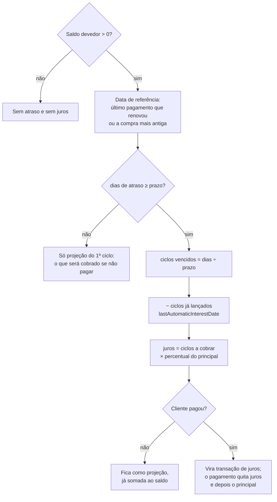

# Juros por atraso

Como o app decide que um cliente está atrasado, quanto de juros ele deve e
quando esse valor vira uma linha no histórico.

Toda a regra mora em [`debt-domain.js`](../debt-domain.js), numa função só —
`calculateSummaryDebt`. O card da lista, o modal do cliente e a página pública
do cliente chamam essa mesma função com o mesmo resumo, justamente para nunca
mostrarem valores diferentes.

---

## Resumo em cinco linhas

1. Toda dívida em aberto tem uma **data de referência**: o último pagamento que
   renovou o prazo ou, se não houve nenhum, a compra mais antiga.
2. O tempo desde a referência é dividido em **ciclos** do tamanho do prazo
   configurado (padrão 60 dias).
3. Cada ciclo que fecha cobra o percentual **uma vez**, sempre sobre o principal.
4. Enquanto ninguém paga, os juros são um cálculo ao vivo — já somado ao saldo
   exibido, mas ainda sem linha no histórico.
5. No pagamento, os juros acumulados viram uma transação de verdade.

---

## 1. Os parâmetros

Três ajustes gerais, em **Configurações → Alertas e juros**:

| Ajuste | Campo salvo | Padrão | Limites |
|---|---|---|---|
| Dias sem pagamento (o tamanho do ciclo) | `settings.overdueAlertDays` | 60 | 1 a 3650 |
| Percentual de juros | `settings.overdueInterest.percent` | 0 | 0 a 100 |
| Juros ligados? | `settings.overdueInterest.enabled` | desligado | — |
| Pagamento mínimo para renovar o prazo | `settings.overdueResetPaymentPercent` | 20% | 0 a 100 |

Com o mínimo em **0%**, qualquer pagamento renova o prazo.

### Taxa individual

Cada cliente pode fugir da regra geral, em **Painel do cliente → Juros por
atraso deste cliente**. O valor fica em `overdueInterestOverride` e substitui
por completo os juros gerais — o prazo e o pagamento mínimo continuam vindo das
configurações gerais.

| Modo | Efeito |
|---|---|
| `global` (sem override) | Segue a taxa geral |
| `custom` | Usa o percentual próprio do cliente |
| `disabled` | Nunca cobra juros desse cliente |

---

## 2. A data de referência

É o marco zero da contagem. Ela é reconstruída a cada leitura, percorrendo o
histórico em ordem cronológica:

- **Último pagamento que renovou o prazo** — um pagamento só renova se atingir o
  mínimo configurado sobre o saldo devedor *no momento do pagamento* (já com os
  juros do ciclo, que entram antes dele). Pagamentos menores abatem a dívida,
  mas não mexem na referência.
- **Se nunca houve um pagamento desses**, a referência é a **compra mais
  antiga** — a venda que fez o saldo sair do zero.

Quando o saldo chega a zero, a referência é descartada. A próxima compra vira o
novo marco zero, e o cliente começa limpo.

O resumo guarda em `referenceType` qual dos dois casos vale, e é isso que decide
a mensagem do card: *"Último pagamento há X dias"* ou *"Nunca realizou
pagamento"*.

---

## 3. Ciclos

```
dias de atraso  = hoje − data de referência
ciclos vencidos = dias de atraso ÷ prazo      (arredondado para baixo)
```

O cliente só entra em atraso quando fecha o primeiro ciclo — antes disso,
`dias de atraso < prazo` e não há cobrança nenhuma.

Linha do tempo com prazo de 60 dias, juros de 10% e uma compra de R$ 100 no dia
0, sem nenhum pagamento:

| Dia | Ciclos vencidos | Juros | Saldo exibido |
|---|---|---|---|
| 59 | 0 | — | R$ 100,00 *(avisa: "serão R$ 10,00")* |
| 60 | 1 | R$ 10,00 | R$ 110,00 |
| 119 | 1 | R$ 10,00 | R$ 110,00 |
| 120 | 2 | R$ 20,00 | R$ 120,00 |
| 180 | 3 | R$ 30,00 | R$ 130,00 |

O valor **não cresce dia a dia**: ele dá um degrau quando o ciclo fecha e fica
parado até o próximo.

---

## 4. A base de cálculo

Os juros incidem sobre o **principal** — o que veio de compras — e nunca sobre
juros já cobrados:

```
base    = principal, limitado pelo saldo atual e nunca negativa
por ciclo = base × percentual
juros   = por ciclo × ciclos a cobrar
```

Ou seja, a cobrança é de **juros simples**. Três ciclos a 10% sobre R$ 100 dão
R$ 30, não R$ 33,10. Um ciclo nunca compõe sobre o outro.

Como o pagamento quita **primeiro os juros e depois o principal**, abater o
principal derruba os juros de todos os ciclos seguintes.

---

## 5. Projeção × lançamento

Há dois estados para o mesmo valor:

**Projeção** — enquanto não há pagamento, os juros são recalculados a cada
leitura da tela. Eles já entram no saldo que aparece na lista, no modal e na
página do cliente, mas ainda não existem como linha no histórico.

**Lançamento** — no momento em que o cliente paga, os juros pendentes viram uma
transação de tipo `interest`, com `automaticInterest: true`, a mesma data do
pagamento e a descrição `Juros por atraso (10% × 3 ciclos)`. O sufixo com a
contagem só aparece quando é mais de um ciclo.

Os juros são gravados **antes** do pagamento, e a ordenação do histórico garante
essa posição pelo vínculo `relatedPaymentId` — não pela chave do banco. Se o par
saísse invertido, o pagamento quitaria o principal antes de os juros existirem e
a base do próximo ciclo ficaria menor que o devido.

---

## 6. O que acontece quando o cliente paga

1. O app calcula os juros dos ciclos vencidos que ainda não foram lançados.
2. Se houver, grava a transação de juros com a data do pagamento.
3. O pagamento abate **os juros primeiro** (os desse lançamento e os que já
   estavam em aberto), e só o que sobra vai para o principal.
4. Se o valor atingiu o mínimo, a referência pula para a data do pagamento e a
   contagem recomeça do zero.

### Caso A — pagou o mínimo

Dia 130, principal R$ 100, 2 ciclos vencidos (R$ 20 de juros), saldo R$ 120.
O mínimo é 20% de R$ 120 = **R$ 24**. O cliente paga **R$ 40**:

- R$ 20 quitam os juros, R$ 20 abatem o principal → saldo R$ 80;
- R$ 40 ≥ R$ 24, então a referência vira o dia 130;
- o próximo ciclo só fecha no dia 190, agora sobre um principal de R$ 80.

### Caso B — pagou menos que o mínimo

Mesma situação, mas o cliente paga **R$ 20**:

- os R$ 20 quitam exatamente os juros, o principal continua em R$ 100;
- R$ 20 < R$ 24, então **a referência continua na compra do dia 0**;
- o sistema anota que 2 ciclos já foram cobrados e volta a cobrar quando o
  terceiro fechar:

| Dia | Ciclos vencidos | Já lançados | A cobrar |
|---|---|---|---|
| 130 | 2 | 2 | R$ 0,00 |
| 179 | 2 | 2 | R$ 0,00 |
| 180 | 3 | 2 | R$ 10,00 |

---

## 7. Como o mesmo ciclo não é cobrado duas vezes

O resumo guarda `lastAutomaticInterestDate`, a data do último lançamento
automático. Dela sai quantos ciclos já tinham fechado quando aquele valor foi
gravado, e esses são descontados dos ciclos vencidos hoje:

```
ciclos já lançados = (data do lançamento − referência) ÷ prazo
ciclos a cobrar    = ciclos vencidos − ciclos já lançados
```

Duas sutilezas importantes:

- A comparação com a referência é **estritamente maior**. Quando o pagamento
  renova o prazo, os juros e a nova referência compartilham a mesma data; tratar
  isso como "já cobrado" faria o ciclo seguinte nunca cobrar nada.
- Para dívidas antigas, cobradas sob a regra anterior (que lançava uma vez só), a
  conta é **conservadora**: se o único lançamento aconteceu lá pelo dia 130, o
  sistema entende que os dois ciclos daquele período já foram cobrados e não vai
  atrás do retroativo. Ele só cobra dos ciclos que fecharem daqui pra frente.

---

## 8. Edição e exclusão

Os lançamentos automáticos são derivados, não digitados — por isso são
protegidos:

| Ação | Resultado |
|---|---|
| Editar uma transação de juros | Bloqueada |
| Excluir os juros sozinhos | Bloqueada — saem junto com o pagamento |
| Editar um pagamento que lançou juros | Bloqueada |
| Excluir esse pagamento | Remove o par (pagamento + juros) numa operação só |

Se um pagamento com juros estiver sem o vínculo, a exclusão é recusada em vez de
deixar um lançamento órfão no histórico.

---

## 9. Onde isso aparece

- **Card da lista** — `⚠️ ... · juros 10% × 3 ciclos`, com o valor no tooltip.
- **Modal do cliente** — o saldo e a nota *"Inclui juros de 10% × 3 ciclos por
  atraso"*.
- **Página pública do cliente** — o bloco de prazo mostra desde quando venceu, o
  valor dos juros, o pagamento mínimo para renovar e, antes do vencimento,
  quantos dias faltam e quanto será cobrado.
- **Histórico** — a linha de juros aparece com tipo `Juros`, filtrável.

---

## 10. Campos gravados

Em `clientSummaries/{id}` (o resumo leve que a home acompanha):

| Campo | Para que serve |
|---|---|
| `baseDebtCents` | Saldo devedor, já com os juros lançados |
| `principalDebtCents` | Só o que veio de compras — a base dos juros |
| `outstandingInterestCents` | Juros lançados e ainda não pagos |
| `referenceDate` | O marco zero da contagem |
| `referenceType` | `payment` ou `first-sale` |
| `lastAutomaticInterestDate` | Até onde a cobrança automática chegou |
| `overdueResetPaymentPercent` | O mínimo vigente quando o resumo foi montado |
| `overdueInterestOverride` | Taxa individual do cliente, se houver |

Na transação de juros: `type: 'interest'`, `automaticInterest: true`,
`relatedPaymentId`. No pagamento que a gerou: `relatedInterestId`,
`interestPaidCents`, `principalPaidCents` e `settlesPreviouslyAppliedInterest`
(marcado quando o pagamento só quita juros de lançamentos anteriores, sem gerar
juros novos).

---

## 11. Casos de borda

- **Saldo zerado ou credor nunca fica atrasado** — sem dívida não há contagem,
  nem juros.
- **Desligar os juros** zera as cobranças futuras, mas mantém no saldo os juros
  que já foram lançados. Eles são dívida como qualquer outra.
- **Mudar o prazo recalcula o passado.** Como tudo é derivado da data de
  referência, baixar "dias sem pagamento" de 60 para 30 dobra os ciclos vencidos
  de todo mundo na hora seguinte. Não é uma mudança retroativa inofensiva.
- **Taxa individual em `disabled`** vence a configuração geral, mesmo com os
  juros gerais ligados.
- **Percentual em 0%** equivale a não cobrar, mesmo com a chave ligada.

---

## Diagrama da decisão



---

## Testes

As regras têm cobertura em
[`scripts/debt-domain.test.mjs`](../scripts/debt-domain.test.mjs):

```powershell
npm test
```
